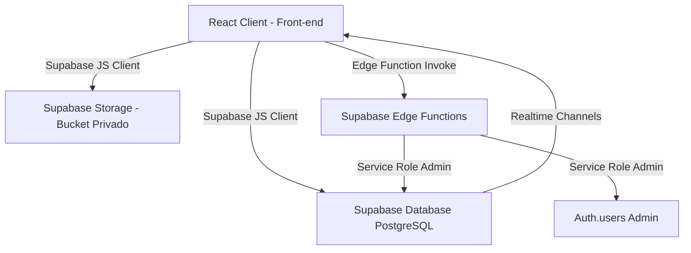

# Contexto Geral do Projeto — Central de Ocorrências CSC (NEC)

Este documento centraliza todas as informações técnicas e arquiteturais do projeto **Central de Ocorrências CSC — NEC**. Destina-se a desenvolvedores seniores que precisam compreender a fundo os caminhos, as tabelas, as regras de RLS (Row Level Security), as Edge Functions, as rotas e os detalhes de implementação de cada função.

---

## 1. Visão Geral da Arquitetura

A aplicação é uma SPA (Single Page Application) construída em **React (Vite)** no front-end, integrada diretamente ao **Supabase** no back-end.



### Tecnologias Utilizadas
- **Front-end**: React 18, React Router DOM v6, Vite, Vanilla CSS.
- **Back-end & Infraestrutura**: Supabase (Database PostgreSQL, Storage para fotos, Autenticação, Realtime WebSockets, Edge Functions com Deno).

---

## 2. Estrutura de Diretórios e Arquivos Principais

A estrutura do projeto está organizada da seguinte forma:

```
central-nec/
├── .env.example                               # Exemplo de variáveis de ambiente do front-end
├── index.html                                 # Ponto de entrada HTML principal
├── package.json                               # Configurações do npm e dependências
├── vite.config.js                             # Configuração do Vite (React plugin)
├── Contexto-criação/
│   └── Ajustes rls etapa4.md                  # Histórico de ajustes de RLS no banco
├── supabase/
│   └── functions/
│       └── admin-usuarios/
│           └── index.ts                       # Código TypeScript da Edge Function Deno
└── src/
    ├── App.jsx                                # Configuração de roteamento (React Router)
    ├── main.jsx                               # Inicialização e renderização do React
    ├── supabaseClient.js                      # Inicialização do cliente Supabase SDK
    ├── components/
    │   ├── ModalDetalheOcorrencia.jsx         # Modal de exibição detalhada e aprovação
    │   ├── ModalNovaOcorrencia.jsx            # Formulário de criação de ocorrências e upload de fotos
    │   ├── OcorrenciasList.jsx                # Lista/tabela de ocorrências com busca e filtros
    │   ├── ProtectedRoute.jsx                 # HOC para proteção de rotas privadas e verificação de perfil
    │   ├── Sidebar.jsx                        # Barra de navegação lateral (dinâmica por perfil)
    │   ├── StatsRow.jsx                       # Cards de indicadores superiores
    │   ├── Toast.jsx                          # Sistema customizado de notificações (ToastContainer/useToast)
    │   └── Topbar.jsx                         # Barra superior com chip de usuário, logout e impressão
    ├── context/
    │   └── AuthContext.jsx                    # Contexto global de sessão e perfil do usuário
    ├── data/
    │   ├── adminUsuarios.js                   # Ponte para invocar as ações administrativas da Edge Function
    │   ├── fotos.js                           # Métodos de upload e geração de URLs assinadas
    │   ├── ocorrencias.js                     # Métodos de CRUD da tabela ocorrencias
    │   └── usuarios.js                        # Métodos de busca de usuários/perfis
    ├── hooks/
    │   └── useOcorrencias.js                  # Hook com busca inicial e assinatura Realtime (WebSockets)
    └── styles/
        └── styles.css                         # Design system e folhas de estilo globais (Vanilla CSS)
```

---

## 3. Variáveis de Ambiente

### Front-end (`.env` ou `.env.example`)
Variáveis utilizadas pelo cliente Supabase no front-end:
- **`VITE_SUPABASE_URL`**: A URL da API do projeto no Supabase (ex: `https://xxxx.supabase.co`).
- **`VITE_SUPABASE_ANON_KEY`**: A chave pública anônima do projeto Supabase.

### Back-end (Edge Functions no Deno)
Disponibilizadas no ambiente das Edge Functions do Supabase:
- **`SUPABASE_URL`**: URL interna da API.
- **`SUPABASE_ANON_KEY`**: Chave pública de acesso anônimo.
- **`SUPABASE_SERVICE_ROLE_KEY`**: Chave de administração (ignora RLS, permite manipular qualquer registro e a API administrativa do Auth).

---

## 4. Estrutura do Banco de Dados (Supabase)

### Tabela `public.usuarios`
Armazena os perfis complementares ao sistema de autenticação (`auth.users`).

| Coluna | Tipo | Restrições / Padrão | Descrição |
| :--- | :--- | :--- | :--- |
| `id` | `uuid` | Primary Key, References `auth.users(id)` | UUID único correspondente ao ID da autenticação. |
| `nome` | `text` | Not Null | Nome completo do usuário. |
| `iniciais` | `text` | Not Null (max 3 char) | Sigla de identificação (ex: "MG"). |
| `email` | `text` | Not Null | E-mail do usuário. |
| `role` | `text` | Not Null (Check: `role IN ('despachante', 'supervisor')`) | Perfil de permissão. |
| `ativo` | `boolean` | Default `true` | Indica se o usuário está ativo no sistema. |
| `criado_em` | `timestamp with time zone` | Default `now()` | Data de criação do perfil. |

### Tabela `public.ocorrencias`
Registros das ocorrências geradas pelo despacho de campo.

| Coluna | Tipo | Restrições / Padrão | Descrição |
| :--- | :--- | :--- | :--- |
| `id` | `uuid` | Primary Key, Default `gen_random_uuid()` | ID interno da ocorrência. |
| `numero_servico` | `text` | Not Null (exatamente 9 dígitos) | Número identificador do serviço de campo. |
| `data_hora` | `timestamp with time zone` | Not Null | Data e hora em que a ocorrência ocorreu. |
| `tipo` | `text` | Not Null | Categoria da ocorrência (ex: "Acidente de trânsito", etc). |
| `csi` | `text` | Not Null | Identificação do CSI envolvido. |
| `equipe` | `text` | Not Null | Identificação/código da equipe de campo. |
| `descricao` | `text` | Not Null | Detalhamento em texto livre. |
| `status` | `text` | Default `'em_analise'` (Check: `'em_analise'`, `'aprovado'`, `'reprovado'`) | Estado atual da ocorrência. |
| `despachante_id` | `uuid` | References `public.usuarios(id)` | UUID do despachante/supervisor criador da ocorrência. |
| `despachante_nome` | `text` | — | Nome do despachante no momento do registro. |
| `fotos` | `jsonb` | Default `null` | Mapa contendo os paths das fotos (`{ rota, conversa_csi, conversa_equipe }`). |
| `supervisor_id` | `uuid` | References `public.usuarios(id)` | UUID do supervisor que tomou a decisão de aprovar/reprovar. |
| `supervisor_nome` | `text` | — | Nome do supervisor que tomou a decisão. |
| `observacao_supervisor` | `text` | — | Justificativa ou feedback dado pelo supervisor (obrigatório em reprovações). |
| `decidido_em` | `timestamp with time zone` | — | Timestamp da decisão tomada. |
| `criado_em` | `timestamp with time zone` | Default `now()` | Data de registro no sistema. |

### Storage Bucket: `ocorrencias-fotos`
- **Tipo**: Privado.
- **Estrutura de arquivos**: Salva as fotos no caminho `{ocorrencia_id}/{tipo_foto}_{timestamp}.{extensão}` (ex: `a5f2-9bc8/rota_1720000000000.jpg`).

---

## 5. Regras de Segurança (RLS - Row Level Security)

### Políticas de RLS da tabela `public.ocorrencias`

1. **`ocorrencias_insert_despachante_supervisor`** (INSERT)
   - **Quem pode**: Qualquer usuário autenticado com perfil `despachante` ou `supervisor`.
   - **Regra**: O criador deve registrar a ocorrência vinculada ao próprio UUID (`despachante_id = auth.uid()`) e com status inicial igual a `'em_analise'`.

2. **`ocorrencias_select_role_based`** (SELECT)
   - **Quem pode**: Qualquer usuário autenticado.
   - **Regra**: Usuários `despachante` visualizam apenas os registros que eles mesmos criaram (`despachante_id = auth.uid()`). Usuários com papel `supervisor` têm acesso a leitura de todas as linhas do banco.

3. **`ocorrencias_update_despachante_fotos`** (UPDATE)
   - **Quem pode**: O criador do registro (`despachante_id = auth.uid()`).
   - **Regra**: Permite atualizar registros enquanto o status estiver em `'em_analise'`. É usado pelo front-end para salvar os paths das fotos no campo `fotos` (jsonb) logo após realizar os uploads.

4. **`ocorrencias_update_supervisor`** (UPDATE)
   - **Quem pode**: Usuários com o papel `supervisor`.
   - **Regra**: Permite atualizar a ocorrência (especificamente colunas `status`, `observacao_supervisor`, `supervisor_id`, `supervisor_nome`, `decidido_em`) apenas se o registro estiver com o status `'em_analise'`.

---

## 6. Módulo de Serviços de Banco e Storage (`src/data`)

### [usuarios.js](file:///c:/APPWEB/central-nec/src/data/usuarios.js)
Abstrai a comunicação direta para a tabela `usuarios`.
- **`buscarUsuario(id)`**:
  - **Parâmetro**: `id` (string/UUID do auth.users).
  - **Função**: Consulta e retorna o perfil correspondente na tabela `public.usuarios` com todas as colunas.
  - **Retorno**: `Promise<object>` ou lança exceção em caso de erro/não encontrado.
- **`buscarTodosUsuarios()`**:
  - **Parâmetro**: Nenhum.
  - **Função**: Busca todos os usuários ordenados alfabeticamente por `nome` (A-Z).
  - **Retorno**: `Promise<Array>`. Requer permissão de leitura pela RLS (permitido apenas para supervisores).

### [adminUsuarios.js](file:///c:/APPWEB/central-nec/src/data/adminUsuarios.js)
Gerencia ações administrativas invocando a Edge Function privada do Supabase.
- **`invocarAdmin(action, payload)`**:
  - **Parâmetros**: `action` (string), `payload` (object).
  - **Função**: Utilitário privado que chama a Edge Function `admin-usuarios` enviando token do usuário logado nos headers de autorização e decodifica a resposta.
  - **Tratamento**: Valida a propriedade `ok` retornada pela função; se falso, lança um erro formatado.
- **`criarUsuario(usuarioData)`**:
  - **Parâmetro**: `usuarioData` contendo `{ email, senha, nome, iniciais, role }`.
  - **Função**: Solicita a criação de uma conta Auth e de um perfil público.
- **`atualizarPerfilUsuario(perfilData)`**:
  - **Parâmetro**: `perfilData` contendo `{ id, nome, iniciais, role }`.
  - **Função**: Solicita a alteração das informações do perfil público do usuário.
- **`trocarSenhaUsuario({ id, novaSenha })`**:
  - **Parâmetros**: `id` (UUID), `novaSenha` (string).
  - **Função**: Solicita a alteração da senha na API de Autenticação administrativa.

### [ocorrencias.js](file:///c:/APPWEB/central-nec/src/data/ocorrencias.js)
Gerencia as operações de persistência das ocorrências.
- **`buscarOcorrencias(filtros)`**:
  - **Parâmetros**: `filtros` (object) contendo opcionalmente `{ despachanteId }`.
  - **Função**: Retorna ocorrências ordenadas de forma decrescente pela coluna `data_hora`. Se o `despachanteId` for fornecido, filtra registros daquele usuário.
- **`criarOcorrencia(dados)`**:
  - **Parâmetros**: `dados` (object) contendo `{ numero_servico, csi, equipe, tipo, descricao, data_hora }`.
  - **Função**: Insere uma nova linha com status `'em_analise'` e retorna os dados persistidos da ocorrência (incluindo o `id` gerado).
- **`atualizarStatusOcorrencia(id, status, observacao, supervisor)`**:
  - **Parâmetros**: `id` (UUID), `status` (string: `'aprovado'` ou `'reprovado'`), `observacao` (string), `supervisor` (object: `{ id, nome }`).
  - **Função**: Atualiza os campos de auditoria de decisão.
- **`atualizarFotosOcorrencia(id, fotos)`**:
  - **Parâmetros**: `id` (UUID), `fotos` (object: `{ rota: string|null, conversa_csi: string|null, conversa_equipe: string|null }`).
  - **Função**: Grava no registro a relação de caminhos das imagens salvas no bucket.

### [fotos.js](file:///c:/APPWEB/central-nec/src/data/fotos.js)
Utilitários de controle físico dos arquivos de evidências.
- **`uploadFoto(ocorrenciaId, tipo, file)`**:
  - **Parâmetros**: `ocorrenciaId` (UUID), `tipo` (string correspondente ao slot), `file` (objeto File do navegador).
  - **Restrições**: Tamanho máximo de 5MB e formatos aceitos: `image/jpeg`, `image/png`, `image/webp`, `image/gif`.
  - **Função**: Executa o upload para a pasta `{ocorrenciaId}` com o formato `{tipo}_{timestamp}.{extensao}`.
  - **Retorno**: `Promise<string>` contendo o path no bucket.
- **`obterUrlAssinada(path)`**:
  - **Parâmetro**: `path` (string).
  - **Função**: Cria um link público assinado temporário com validade de 1 hora (3600 segundos) para exibição segura de imagem.
  - **Retorno**: `Promise<string>`.

---

## 7. Edge Function Deno: `admin-usuarios`

Localizada em `supabase/functions/admin-usuarios/index.ts`. Como no Supabase comum a criação de usuários contorna a confirmação de e-mail e necessita de privilégios elevados, essa função utiliza a `service_role_key` com escopo administrativo.

### Fluxo de Execução
1. **Tratamento de CORS (Preflight)**: Responde a requisições `OPTIONS` com cabeçalhos padrão.
2. **Validação do Chamador**: Extrai o token JWT Bearer do cabeçalho `Authorization`. Valida o token com o cliente Supabase anônimo. Recupera o UUID do chamador.
3. **Validação de Função**: Consulta a tabela `public.usuarios` com privilégio de admin para checar se o chamador tem papel `supervisor`. Caso negativo, retorna status `403`.
4. **Execução de Ações (`action`)**:
   - **`criar`**:
     - Cria um novo login na autenticação administrativa do Supabase (`adminClient.auth.admin.createUser`) com o e-mail e senha informados, marcando o e-mail como pré-confirmado (`email_confirm: true`).
     - Tenta inserir a linha de perfil correspondente na tabela `public.usuarios`.
     - *Rollback*: Caso a inserção na tabela de banco falhe, remove a conta recém-criada no Auth (`adminClient.auth.admin.deleteUser`) para evitar inconsistências orfãs.
   - **`atualizar_perfil`**:
     - Executa um `update` simples na tabela `public.usuarios` alterando `nome`, `iniciais` e `role`.
   - **`trocar_senha`**:
     - Altera a senha diretamente no Auth usando o UUID do usuário de destino (`adminClient.auth.admin.updateUserById`).

---

## 8. Gerenciamento de Estado e Ciclo de Vida do Front-end

### [AuthContext.jsx](file:///c:/APPWEB/central-nec/src/context/AuthContext.jsx)
Provedor de contexto global (`AuthProvider`) que inicializa e expõe a sessão.
- Utiliza `supabase.auth.getSession()` no carregamento inicial da aplicação.
- Escuta mudanças de estado do usuário via `supabase.auth.onAuthStateChange`.
- Quando um usuário é detectado, executa internamente a função `carregarPerfil(sessionUser)` para buscar suas propriedades no banco de dados. Caso o usuário não possua perfil correspondente na tabela `public.usuarios`, o contexto marca a chave `erroPerfil` (causando o bloqueio visual do usuário).

### [useOcorrencias.js](file:///c:/APPWEB/central-nec/src/hooks/useOcorrencias.js)
Hook customizado para a escuta e reatividade em tempo real.
- Executa a busca primária na montagem usando `buscarOcorrencias()`.
- Cria um canal WebSocket dinâmico (`supabase.channel`) filtrado opcionalmente por `despachante_id` caso o papel do usuário logado seja `despachante`.
- **Eventos Realtime**:
  - `INSERT`: Adiciona a nova ocorrência no topo do array ordenando por data.
  - `UPDATE`: Atualiza apenas o objeto modificado mantendo a posição original.
  - `DELETE`: Remove do array local o registro que foi deletado do banco de dados.
- O cleanup remove o canal (`supabase.removeChannel`) no desmontar do componente para prevenir vazamento de conexões.

---

## 9. Roteamento do Front-end

Configurado em `src/App.jsx` usando `react-router-dom`:

- **`/login`** -> Carrega o componente [Login](file:///c:/APPWEB/central-nec/src/pages/Login.jsx).
- **`/`** -> Rota protegida ([Painel](file:///c:/APPWEB/central-nec/src/pages/Painel.jsx)).
- **`/usuarios`** -> Rota protegida ([GestaoUsuarios](file:///c:/APPWEB/central-nec/src/pages/GestaoUsuarios.jsx)).
- **`*`** -> Redireciona qualquer caminho inválido de volta para a raiz `/`.

### Proteção de Rotas ([ProtectedRoute.jsx](file:///c:/APPWEB/central-nec/src/components/ProtectedRoute.jsx))
- Bloqueia renderização se estiver em estado de carregamento (`loading` do contexto).
- Se a sessão não existir no contexto, redireciona o usuário para `/login`.
- Se existir uma sessão mas o perfil não puder ser carregado no banco de dados (`erroPerfil`), exibe a tela de erro **"Conta não configurada"**, permitindo apenas realizar logout.

---

## 10. Principais Fluxos Visuais e Lógicas de Componentes

### Criação de Ocorrência ([ModalNovaOcorrencia.jsx](file:///c:/APPWEB/central-nec/src/components/ModalNovaOcorrencia.jsx))
1. O usuário preenche campos (validações: todos os campos requeridos, `numero_servico` contendo exatamente 9 dígitos numéricos).
2. O usuário seleciona opcionalmente arquivos para os slots de imagem (`rota`, `conversa_csi`, `conversa_equipe`). A seleção gera um preview local instantâneo (`FileReader.readAsDataURL`).
3. Ao submeter:
   - Primeiro insere a linha na tabela `ocorrencias` via `criarOcorrencia()` (sem fotos, status inicial `'em_analise'`).
   - Se for bem-sucedido, inicia os uploads individuais das imagens via `uploadFoto()`. Falhas parciais em fotos de slots individuais disparam Toasts, mas não interrompem o fluxo nem excluem o registro principal.
   - Os caminhos das fotos que subiram com sucesso são consolidados em um objeto jsonb e salvos no registro da ocorrência usando `atualizarFotosOcorrencia()`.
   - O modal é fechado, e a reatividade do canal de realtime atualiza a listagem na tela do usuário.

### Exibição e Avaliação de Ocorrências ([ModalDetalheOcorrencia.jsx](file:///c:/APPWEB/central-nec/src/components/ModalDetalheOcorrencia.jsx))
1. Ao clicar na linha da tabela, armazena o objeto da ocorrência no estado local e abre o modal.
2. O modal identifica se existem caminhos mapeados no objeto `fotos` e dispara requisições assíncronas em paralelo (`Promise.all`) para o método `obterUrlAssinada()` para cada chave.
3. Se o usuário atual for um `supervisor` e o status do registro for `'em_analise'`:
   - Apresenta o componente `DecisionForm` com uma caixa de observações e botões de **Aprovar** e **Reprovar**.
   - A reprovação exige obrigatoriamente a escrita de uma observação.
   - A submissão atualiza o registro com `atualizarStatusOcorrencia()`, enviando os dados de identificação do supervisor, o status definido e a observação de feedback.

### Exportação de Relatório ([Topbar.jsx](file:///c:/APPWEB/central-nec/src/components/Topbar.jsx))
- A função `handlePrint(ocorrencias, filtroLabel)` é invocada ao clicar em "Exportar".
- Ela gera dinamicamente uma página HTML autônoma contendo os dados e os status dos registros visíveis com estilos CSS para visualização e quebra de páginas otimizados para impressão (`@media print`).
- Dispara o método `window.print()` nativo no navegador do usuário.

### Painel e Filtros ([Painel.jsx](file:///c:/APPWEB/central-nec/src/pages/Painel.jsx))
- Filtra em memória (client-side) os registros retornados pelo hook `useOcorrencias`.
- Permite filtro de texto nos campos `numero_servico`, `csi` e `equipe` simultaneamente.
- Permite filtros rápidos por status de aprovação utilizando botões de chip.

---

## 11. Estilos e Sistema de Design (CSS)

Toda a parte visual do projeto é controlada centralizadamente em [styles.css](file:///c:/APPWEB/central-nec/src/styles/styles.css) utilizando variáveis CSS nativas (custom properties) para as cores primárias, secundárias, estados e escalas de espaçamento:

- `--bg`: Cor de fundo da aplicação (escura).
- `--surface` / `--surface-alt`: Fundos de cartões e áreas internas de painéis.
- `--border`: Borda de separadores e campos de formulário.
- `--text` / `--text-muted` / `--text-faint`: Escalas de cores tipográficas.
- `--blue` / `--green` / `--red` / `--amber`: Cores semânticas de status (`em_analise`, `aprovado`, `reprovado`, etc.).

---

Este documento serve como fonte da verdade técnica do ecossistema da **Central de Ocorrências CSC (NEC)**. Qualquer alteração estrutural no banco, regras de RLS ou contratos das Edge Functions deve ser refletida aqui.
